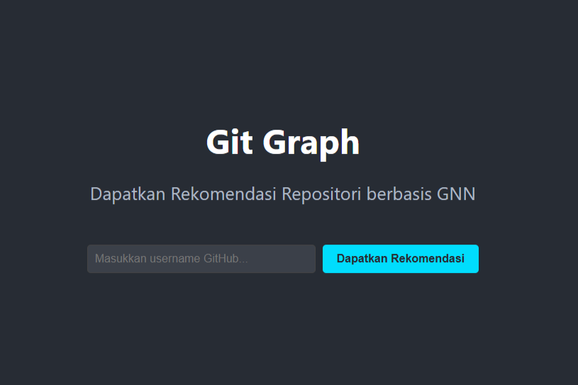

# GitGraph 

### A GNN-Powered GitHub Network Analyzer

GitGraph adalah sebuah platform analisis cerdas yang menggunakan Graph Neural Network (GNN) untuk mengungkap wawasan mendalam dari ekosistem GitHub. Alih-alih metrik dangkal seperti jumlah bintang, GitGraph menganalisis hubungan antara developer dan repositori untuk memberikan rekomendasi proyek yang sangat relevan dan memetakan jalur kolaborasi.



---

## ✨ Fitur Utama

* **Rekomendasi Repositori Cerdas:** Dapatkan rekomendasi proyek yang dipersonalisasi berdasarkan analisis GNN terhadap minat dan koneksi Anda, bukan hanya berdasarkan tag populer.
* **Pencari Ahli (Expert Finder):** Temukan developer berpengaruh dalam domain teknologi tertentu berdasarkan kontribusi dan sentralitas mereka di dalam graf.
* **Visualisasi Kolaborasi:** Masukkan dua username GitHub dan lihat visualisasi graf interaktif yang menunjukkan bagaimana mereka terhubung melalui repositori atau kontributor bersama.

---

## 🧠 Arsitektur GNN

Model Graph Neural Network (GNN) pada proyek ini dirancang khusus untuk menangani **graf heterogen**—sebuah graf yang memiliki beberapa tipe node (`User`, `Repository`) dan tipe edge (`STARS`). Karena itu, arsitektur ini menggunakan `HeteroConv` dari library PyTorch Geometric untuk memproses informasi secara efektif.

Secara konseptual, alur kerja model adalah sebagai berikut:

```
[Fitur Awal Node] ==> [Layer HeteroConv #1] ==> [Aktivasi ReLU] ==> [Layer HeteroConv #2] ==> [Embedding Akhir]
```

#### Komponen Utama:

1.  **Encoder (`HeteroGNN`)**:
    * **Inti Model**: Model utama bertindak sebagai *encoder* yang bertugas mengubah fitur awal setiap node menjadi *embedding*—vektor numerik berdimensi rendah yang kaya akan informasi kontekstual dan topologis.
    * **Layer Konvolusi**: Inti dari encoder adalah dua lapis `HeteroConv`. Setiap layer `HeteroConv` membungkus sebuah layer `SAGEConv`.
    * **`SAGEConv`**: Layer ini bekerja dengan cara mengagregasi informasi fitur dari node-node tetangga untuk memperbarui representasi sebuah node. Ini memungkinkan informasi mengalir dari satu node ke node lain di seluruh graf.
    * **Alur Informasi**: Informasi mengalir dua arah antara `User` dan `Repository` (`user` -> `stars` -> `repo` dan sebaliknya) untuk menghasilkan embedding yang komprehensif.

2.  **Decoder (Prediksi Link)**:
    * Setelah *encoder* menghasilkan embedding akhir untuk semua `User` dan `Repository`, sebuah *decoder* sederhana digunakan untuk tugas prediksi link.
    * **Mekanisme**: *Decoder* mengambil embedding dari sepasang `User` dan `Repository`, lalu menghitung **dot product** di antara keduanya.
    * **Hasil**: Skor dot product yang tinggi mengindikasikan bahwa model memprediksi adanya kemungkinan hubungan `STARS` yang kuat antara user dan repositori tersebut.

Arsitektur encoder-decoder ini dilatih secara *end-to-end* untuk meminimalkan kesalahan prediksi link, sehingga menghasilkan embedding yang optimal untuk tugas rekomendasi.

#### Contoh Struktur & Output Model

Berikut adalah contoh output aktual dari beberapa tahapan dalam proses machine learning, yang menunjukkan struktur data dan model.

* **Struktur Graf Input (`HeteroData`)**
    Objek `HeteroData` dari PyTorch Geometric digunakan untuk merepresentasikan graf:
    ```python
    HeteroData(
      user={ x=[2617, 128] },
      repo={ x=[100, 257] },
      (user, stars, repo)={ edge_index=[2, 2693] },
      (repo, rev_stars, user)={ edge_index=[2, 2693] }
    )
    ```

* **Arsitektur Model GNN**
    Arsitektur model GNN yang terdiri dari dua layer `HeteroConv`:
    ```python
    HeteroGNN(
      (conv1): HeteroConv(num_relations=2)
      (conv2): HeteroConv(num_relations=2)
    )
    ```

* **Output Embedding Final**
    Setelah melewati model, setiap node `user` dan `repo` memiliki embedding akhir berukuran 32 dimensi:
    ```text
    Output model (dictionary of embeddings):
    - Tipe Node: 'repo', Ukuran Embedding: torch.Size([100, 32])
    - Tipe Node: 'user', Ukuran Embedding: torch.Size([2617, 32])
    ```

---

## 🛠️ Tech Stack

Tabel di bawah ini menunjukkan teknologi utama yang digunakan dalam proyek ini.

| Kategori           | Teknologi                                                                                                                                                                                                                                   |
| ------------------ | ------------------------------------------------------------------------------------------------------------------------------------------------------------------------------------------------------------------------------------------- |
| **Frontend** |                                                                                                                                              |
| **Backend** |                                                       |
| **Machine Learning** |    |
| **Database** |                                                                                                                                                |
| **Deployment** |                                                                                                                                             |

---

## 🚀 Setup & Instalasi Lokal

Untuk menjalankan project di local, ikuti langkah-langkah berikut.

### Pre-requisities

* Python 3.9+
* Node.js & npm
* Docker & Docker Desktop

### 1. Clone Repo

```bash
git clone [https://github.com/your-username/gitgraph-project.git](https://github.com/your-username/gitgraph-project.git)
cd gitgraph-project
```

### 2. Backend Setup

```bash
# Masuk ke direktori backend
cd backend

# Buat dan aktifkan virtual environment
python -m venv venv
# Windows: .\venv\Scripts\activate
# macOS/Linux: source venv/bin/activate

# Install dependencies
pip install -r requirements.txt
```

### 3. Database Setup

```bash
# Pastikan Docker Desktop sedang berjalan
# Jalankan container Neo4j dari root direktori proyek
# Ganti 'your_secure_password' dengan password Anda
docker run -d --name gitgraph-neo4j -p 7474:7474 -p 7687:7687 -v $PWD/neo4j/data:/data -e NEO4J_AUTH=neo4j/your_secure_password neo4j:latest
```

### 4. Frontend Setup

```bash
# Buka terminal baru di root direktori proyek
# Masuk ke direktori frontend
cd frontend

# Install dependencies
npm install
```

---

## ⚙️ Cara Menggunakan Aplikasi

1.  **Isi Database:**
    * Siapkan file `.env` di dalam folder `backend` dengan kredensial GitHub dan Neo4j Anda.
    * Jalankan script *scraper* untuk mengumpulkan data:
        ```bash
        # Di dalam direktori backend dengan venv aktif
        python scraper.py
        ```

2.  **Jalankan Server Backend:**
    ```bash
    # Di dalam direktori backend dengan venv aktif
    uvicorn main:app --reload
    ```
    Server akan berjalan di `http://localhost:8000`.

3.  **Jalankan Aplikasi Frontend:**
    ```bash
    # Di dalam direktori frontend
    npm start
    ```
    Aplikasi akan terbuka di browser Anda di `http://localhost:3000`.

4.  **Gunakan Aplikasi:**
    * Buka `http://localhost:3000`.
    * Masukkan username GitHub yang ada di dataset Anda.
    * Klik tombol untuk melihat rekomendasi!